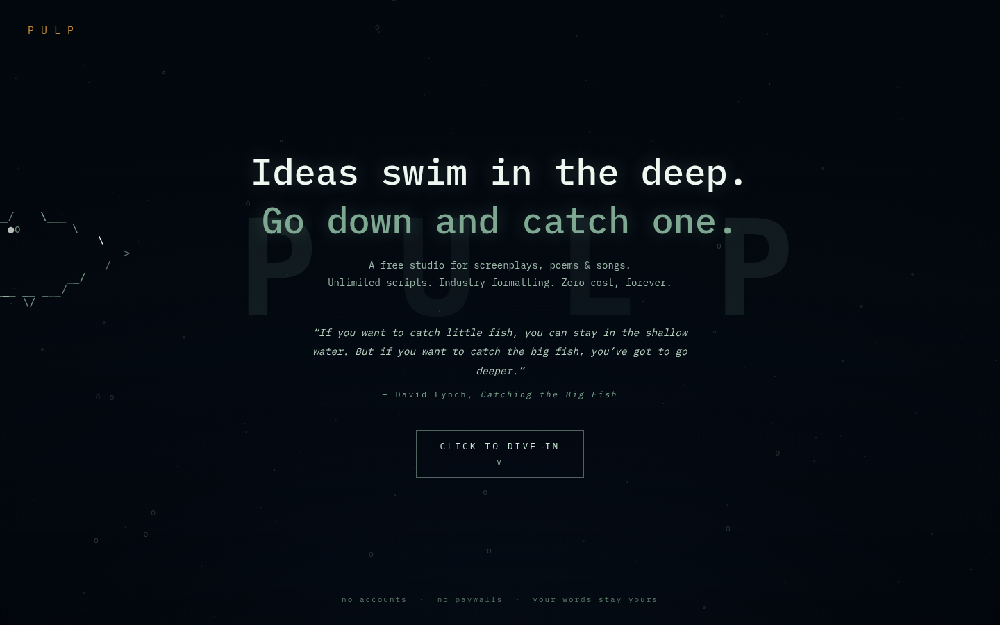

# PULP — a free studio for screenplays, poems & songs



> Ideas swim in the deep. Go down and catch one.

**Pulp is a free, unlimited writing studio for screenwriters, poets and songwriters** — everything the paid software charges for, with nothing held back.

## The problem

Professional screenwriting software costs hundreds of dollars and rents your own words back to you by subscription. Emerging writers — students, indie filmmakers, poets, lyricists — either pay up or write in tools that don't understand what a screenplay is. The formatting a writer needs is not a luxury feature. It is the desk itself.

## The solution

Pulp is that desk, **free forever**:

- **Industry-standard screenplay engine** — Scene Heading / Action / Character / Parenthetical / Dialogue / Transition / Shot, with Final Draft-style `Tab` cycling and smart `Enter` transitions, `INT./EXT.` auto-detection, auto-uppercased character names, and character-name autocomplete.
- **The page is a canvas** — the document floats as a physical sheet on a dark, textured desk. Typewriter mode keeps your line centered; Focus mode dims everything but the active paragraph.
- **Poem & song modes** — verse/stanza and lyric/section formatting, each with its own element logic.
- **Unlimited everything** — unlimited scripts, unlimited pages, no tiers, no watermarks, no page counting.
- **Title pages, scene navigator, live stats** — pages, words, and estimated runtime (1 page ≈ 1 min).
- **Real exports** — `.fountain` (the open screenplay interchange format), print-to-PDF with proper screenplay pagination, and plain text.
- **Your words stay yours** — projects sync to your own shelf; works fully offline with an honest sync indicator.

**Positioning: free forever for writers.** No accounts, no paywalls, no "pro" locked behind a card. We will never hold a draft hostage.

## Screenshots

| The deep (landing) | The canvas (studio) |
|---|---|
|  | *studio screenshot — coming with the next pass* |

## Tech stack

- **Next.js 15 (App Router)** on Vercel — server-rendered shell, API routes for persistence
- **Neon Postgres** — `devices` + `projects` tables; v1 auth is an anonymous device UUID (client-generated, `x-device-id` header), every row scoped to its device
- **Vanilla JS formatting engine** (`public/js/studio.js`) — contenteditable block model, zero editor-framework weight
- **Canvas ASCII animation** (`public/js/fish.js`) — the deep: original hand-drawn ASCII fish, per-character phosphor flicker, drifting PULP letterforms
- **Offline-first** — localStorage cache; syncs to `/api/projects` when online; the app never breaks without a connection

### API

| Method | Route | Notes |
|---|---|---|
| GET / POST | `/api/projects` | list / create (scoped to `x-device-id`) |
| GET / PUT / DELETE | `/api/projects/[id]` | row-level device scoping on every op |

`DATABASE_URL` is set as an encrypted Vercel env var (production + preview + development). It never appears in the repo or the client bundle.

### Local development

```bash
npm install
# set DATABASE_URL (pooled Neon URI) in .env.local — see schema.sql for the schema
npm run dev
```

Apply the schema with `scripts/neon_apply.py` (uses the connected Neon credential; URI stays in memory).

## Roadmap

- **Accounts & auth** — optional sign-in, device linking, true multi-device sync
- **Collaboration** — shared drafts, comments, suggestion mode
- **Fountain import** — round-trip `.fountain` files into the editor
- **Revision modes** — industry revision colors (blue, pink, yellow pages)
- **Mobile** — a writing-first small-screen experience
- **Beats & outlines** — index-card board feeding the draft

## License

MIT — see [LICENSE](LICENSE).
